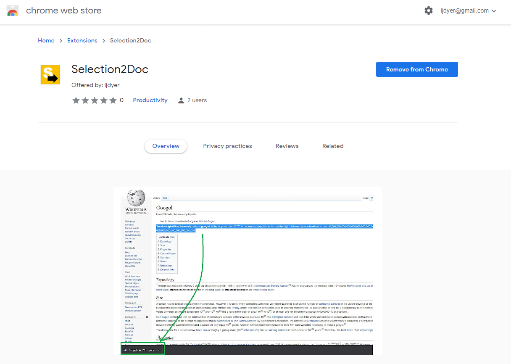
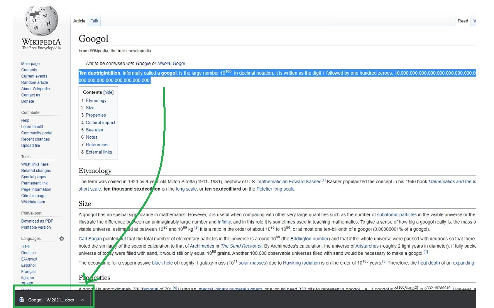

# selection2doc

selection2doc is a Google Chrome extension that lets you download the selected text on a webpage as a Word file.

It was developed for use as a productivity tool for a team of translators whose daily work includes extracting specific portions of text from pages on certain browser-based systems.

## How to use

1. Go to the extension page on the [Chrome Web Store](https://chrome.google.com/webstore/detail/dom2doc/bfgjdnmanmdaklalneoehioaklbdgaej?hl=en-GB).

2. Follow the instructions to add the extension to your browser, and pin the extension icon to the extensions menu.
3. Navigate to the page you want to get text from, select the text you want, and click the extension icon in the top right of the browser window.

4. Open up the Microsoft Word document that was saved to your downloads folder.